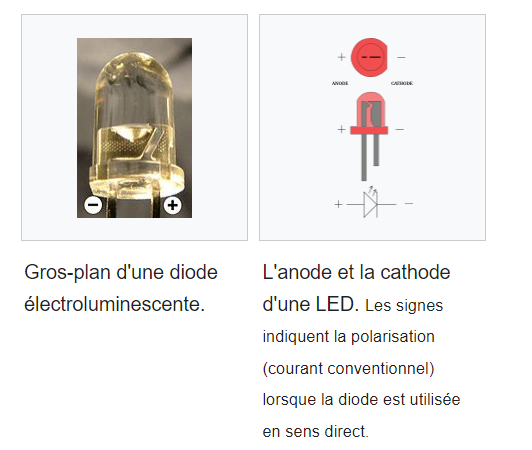
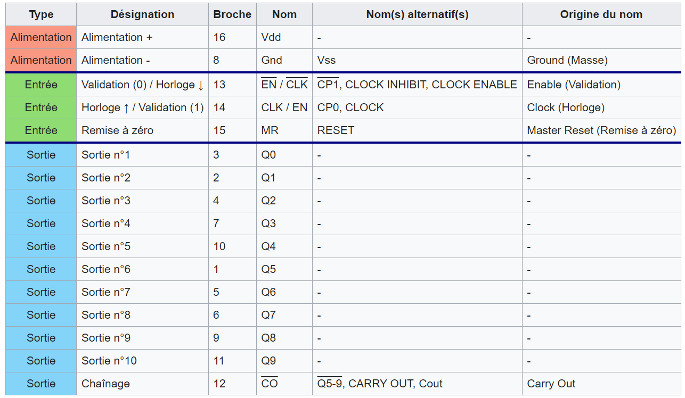

# Aboubacar Bermone

## 👨‍🎓 Profil

Étudiant en 2ᵉ année du cycle ingénieur en **génie électrique et électronique** à **Toulouse INP – ENSEEIHT**.  
Orienté systèmes mécatroniques, automatisme et robotique.
Étudiant-Entrepreneur (SNEE).

📍 Toulouse, France  
📧 bermone.tech@gmail.com

---

## 🎓 Parcours académique

**2025 – 2027**  
**Cycle ingénieur – Génie électrique et électronique**  
Toulouse INP – ENSEEIHT (N7), France

**2024 – 2025**  
**Licence en mécatronique – Génie électrique**  
Université de Strasbourg, France

**2023 – 2024**  
**Cycle Ingénieur – Génie électrique**  
Ecole Polytechique D'Agadir, Maroc

**2021 – 2023**  
**BTS en mécatronique**  
OFPPT, Oujda, Maroc

---

## 🛠️ Projets et expériences

### 🔬 Stage de recherche – INSA & ICube Strasbourg  
**Juin – Août 2025**

- Test et programmation d’une carte électronique intégrant des **capteurs chimiques et de particules** pour la détection de pollution sur drone.  
- Étude, **calibration et validation expérimentale** de capteurs de gaz (CNRS) et de particules fines.  
- Développement d’un **système de chauffage régulé** avec boucle proportionnelle-intégrale et sécurité intégrée.

---

### 🏭 Stage technique – COLAIMO (Industrie agroalimentaire)  
**Février – Avril 2023**

- Réalisation d’une **boucle de refroidissement automatisée** pour yaourt brassé.  
- Programmation d’automates **Siemens (TIA Portal)** et supervision via **WinCC**.  
- Mise en service d’automates industriels.  
- Conception et câblage d’un **système d’alimentation de secours** par groupe électrogène.

---

### 🚁 Projet académique – Université de Strasbourg  
**2024 – 2025**

- Conception complète d’un **drone de secours** : dimensionnement, électronique embarquée et pilotage.  
- Analyse et comparaison de signaux par **clustering sous MATLAB**.  
- Développement d’algorithmes d’**intelligence artificielle appliqués au traitement du signal**.

---

### ☀️ Projet académique – École Polytechnique d’Agadir & OFPPT  
**2023 – 2024**

- Développement d’un **tracker solaire** et d’un système de gestion automatisée de l’éclairage public.  
- Programmation de microcontrôleurs avec **MikroC** et tests en conditions réelles.  
- Programmation d’un **robot industriel Mitsubishi RV-2SDB (FESTO)** avec CIROS en langage C.  
- Gestion de positions par capteurs et automatisation de trajectoires.

---

## ⚙️ Compétences techniques

### Électronique & systèmes
- Électronique analogique et numérique  
- Systèmes mécatroniques  
- Capteurs et instrumentation  
- Régulation PID  
- Mise en service et diagnostic terrain  

### Automatisme & programmation
- Siemens **Step7, TIA Portal, WinCC**  
- API Siemens S7-300 / S7-1200  
- **MATLAB** (automatique, intelligence artificielle)  
- **VHDL (FPGA)**  
- **ROS**

### CAO & simulation
- **Inventor** (conception mécanique / CAO)  
- **Proteus Professional** (schémas, simulation, PCB)  
- **SEE Electrical**  
- **PVsyst** (dimensionnement solaire)

---

## 🌍 Langues

- **Français** : langue maternelle  
- **Anglais** : niveau professionnel  
- **Allemand** : A2  
---

## 🤝 Compétences transversales

- Travail en équipe et communication technique  
- Autonomie et résolution de problèmes  
- Adaptabilité aux nouvelles technologies  
- Rigueur et organisation
---

## 📄 Documents importants

- [Projet Personnel Professionnel (PPP)](PPP%20(Projet%20Personnel%20Professionnel).pdf)
- [CV en Français](CV%20en%20Français.pdf)
- [CV en Anglais](CV%20en%20Anglais.pdf)
- [Rapport de stage ICUBE & INSA Strasbourg](RAPPORT%20DE%20STAGE%20ICUBE%20et%20INSA%20Strasbourg....pdf)
- [Stage ICUBE Strasbourg et INSA](Stage%20ICUBE%20Strasbourg%20et%20INSA.pdf)

## 🖼️ Illustrations techniques
Réalisations d'une carte électronique avec Proteus (ISIS)
- 
- 
- 
- 
- 
- 
- 

## 📦 Autres fichiers
Projet Drone de sécours :
- [Drone Strasbourg L3](Drone%20Strasbourg%20L3.pdf)

